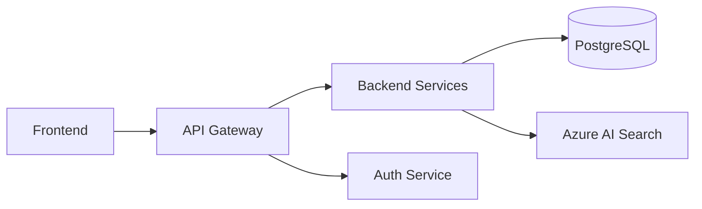

# 📘 ATHINA VSM – Guía Completa del Panel de Administración

> Guía paso a paso para crear departamentos, formularios, proyectos y Value Stream Maps desde el panel de administración de Django.

---

## 📑 Tabla de Contenidos

1. [Acceso al Panel de Admin](#-1-acceso-al-panel-de-admin)
2. [Estructura de Datos: ¿Qué es cada cosa?](#-2-estructura-de-datos-qué-es-cada-cosa)
3. [Los Dos Caminos para crear un VSM](#-3-los-dos-caminos-para-crear-un-vsm)
4. [Guía: Crear Departamentos (Categories)](#-4-guía-crear-departamentos-categories)
5. [Guía: Crear Formularios (Sections + Questions)](#-5-guía-crear-formularios-sections--questions)
6. [Tipos de Preguntas y Diferencias](#-6-tipos-de-preguntas-y-diferencias)
7. [Guía: Crear Proyectos](#-7-guía-crear-proyectos)
8. [Guía: Crear un VSM Manualmente](#-8-guía-crear-un-vsm-manualmente)
9. [Guía: Generar un VSM con IA](#-9-guía-generar-un-vsm-con-ia)
10. [Configurar la IA (AI Configuration)](#-10-configurar-la-ia-ai-configuration)
11. [Gestionar Diagramas Mermaid](#-11-gestionar-diagramas-mermaid)
12. [Gestionar Respuestas de Cuestionarios](#-12-gestionar-respuestas-de-cuestionarios)
13. [Preguntas Frecuentes (FAQ)](#-13-preguntas-frecuentes-faq)
14. [Referencia Rápida](#-14-referencia-rápida)

---

## 🔑 1. Acceso al Panel de Admin

1. Abre tu navegador y ve a: `http://localhost:8000/admin/`
2. Inicia sesión con tus credenciales de superusuario
3. Verás el panel principal con todas las secciones disponibles:

```
┌──────────────────────────────────────┐
│  ATHINA VSM – Admin                 │
├──────────────────────────────────────┤
│  📁 VSM                             │
│    ├── AI configurations             │
│    ├── Categories (Departamentos)    │
│    ├── Sections (Secciones)          │
│    ├── Questions (Preguntas)         │
│    ├── Projects (Proyectos)          │
│    ├── Form responses (Respuestas)   │
│    ├── Value streams (VSMs)          │
│    ├── Process steps (Pasos)         │
│    └── Diagrams (Diagramas)          │
└──────────────────────────────────────┘
```

> 💡 **Tip**: Si no tienes usuario, créalo con:
> ```bash
> docker compose exec web python manage.py createsuperuser
> ```

---

## 🧱 2. Estructura de Datos: ¿Qué es cada cosa?

El sistema tiene una estructura jerárquica. Entenderla es clave para usarlo bien:

```
📁 Project (Proyecto)
│   Agrupa todo: cuestionarios, VSMs y diagramas
│
├── 📝 FormResponse (Respuestas)
│   │   Las respuestas que los equipos dan al cuestionario
│   │
│   └── 🏢 Category (Departamento)
│       │   Ej: "Developers", "QA / Testing", "DevOps"
│       │
│       └── 📂 Section (Sección del formulario)
│           │   Ej: "Team Identity", "Process Steps", "VSM Metrics"
│           │
│           └── ❓ Question (Pregunta individual)
│               Ej: "Average work time in hours" (tipo: text)
│
├── 🗺️ ValueStream (Mapa de Flujo de Valor)
│   │   El VSM resultante, creado manual o con IA
│   │
│   └── ⚙️ ProcessStep (Paso del proceso)
│       Cada nodo del mapa con tiempos y métricas
│
└── 📊 Diagram (Diagrama Mermaid)
    Diagramas visuales adicionales del proyecto
```

### Relaciones clave

| Elemento | Pertenece a | Contiene |
|----------|-------------|----------|
| **Project** | — | Responses, ValueStreams, Diagrams |
| **Category** | — | Sections |
| **Section** | Category | Questions |
| **Question** | Section | — |
| **FormResponse** | Category + Project | Datos JSON |
| **ValueStream** | Project | ProcessSteps |
| **ProcessStep** | ValueStream + Category | Métricas de tiempo |
| **Diagram** | Project | Código Mermaid |

---

## 🔀 3. Los Dos Caminos para crear un VSM

Existen **dos formas** de crear un Value Stream Map:

### Opción A: Flujo por Cuestionarios (con IA) 🤖

```
Crear Proyecto → Equipos rellenan cuestionarios → Revisar respuestas → IA genera VSM
```

- ✅ Ideal cuando tienes varios equipos y quieres datos reales
- ✅ La IA analiza las respuestas y crea el mapa automáticamente
- ⚠️ Requiere configurar la IA (API key de OpenAI o Azure OpenAI)
- ⚠️ Requiere que los equipos completen los cuestionarios

### Opción B: Flujo Admin (Manual) ✏️

```
Crear Departamentos → Crear Formularios → Crear Proyecto → Crear VSM manualmente
```

- ✅ Control total sobre cada paso del mapa
- ✅ No requiere IA ni cuestionarios
- ✅ Ideal para VSMs rápidos o cuando ya conoces los datos
- ⚠️ Requiere conocer las métricas de tiempo de cada paso

---

## 🏢 4. Guía: Crear Departamentos (Categories)

Los **departamentos** (llamados "Categories" en el sistema) representan los equipos que participan en el flujo de valor.

### Departamentos que vienen por defecto

El sistema viene con **7 departamentos** precargados:

| # | Departamento | Slug | Color | Descripción |
|---|-------------|------|-------|-------------|
| 1 | Developers | `developers` | 🔵 `#2563eb` | Backend & frontend development |
| 2 | QA / Testing | `qa-testing` | 🟣 `#9333ea` | Quality assurance and testing |
| 3 | UX / Design | `ux-design` | 🟠 `#ea580c` | User experience and interface design |
| 4 | Data / Analytics | `data-analytics` | 🔵 `#0891b2` | Data engineering, ETL and analytics |
| 5 | Agile / Scrum | `agile-scrum` | 🟢 `#16a34a` | Scrum masters, agile coaches |
| 6 | Management | `management` | 🔴 `#dc2626` | Product owners, programme management |
| 7 | DevOps / Platform | `devops-platform` | 🟣 `#4f46e5` | DevOps, SRE, platform engineering |

### Crear un nuevo departamento

1. Ve a **Admin → Categories → Add Category**
2. Rellena los campos:

| Campo | Qué poner | Ejemplo |
|-------|-----------|---------|
| **Name** | Nombre del departamento | `Security` |
| **Slug** | Se genera automáticamente del nombre | `security` |
| **Color** | Color hexadecimal para la UI | `#e11d48` |
| **Order** | Orden de aparición (1, 2, 3...) | `8` |
| **Description** | Descripción breve | `Application security team` |

3. **Opcional**: Puedes añadir secciones directamente desde aquí (ver el inline "Sections" abajo del formulario)
4. Haz clic en **Save**

> 💡 **El slug es importante**: se usa en las URLs. Se genera automáticamente al escribir el nombre.

---

## 📄 5. Guía: Crear Formularios (Sections + Questions)

Cada departamento tiene **secciones**, y cada sección tiene **preguntas**. Juntas forman el cuestionario.

### Estructura estándar de un formulario

Cada departamento viene con **7 secciones** estándar (A-G):

| Código | Sección | Propósito | Tipo de datos |
|--------|---------|-----------|---------------|
| **A** | Team Identity | Quién es el equipo, clientes y proveedores | Cualitativo |
| **B** | Process Steps | Pasos del proceso con métricas por tabla | Mixto |
| **C** | Handoffs & Dependencies | Entregas, dependencias y cuellos de botella | Cualitativo |
| **D** | Pain Points & Waste | Problemas, retrabajo y desperdicios | Cualitativo |
| **E** | Tools & Systems | Herramientas utilizadas | Cualitativo |
| **F** | Improvement Ideas | Ideas de mejora y quick wins | Cualitativo |
| **G** | VSM Metrics | **Métricas numéricas para el mapa** | **Cuantitativo** |

### ⭐ La Sección G es especial

La sección G (**"VSM Metrics - for automated map generation"**) es la que alimenta directamente al generador de VSM (tanto manual como IA). Contiene datos numéricos estructurados:

| Pregunta | Para qué sirve | Ejemplo |
|----------|----------------|---------|
| `work_time` | Tiempo de trabajo (horas) | `16` |
| `wait_time` | Tiempo de espera (horas) | `8` |
| `rework_pct` | % de retrabajo (0-100) | `25` |
| `people` | Personas involucradas | `3` |
| `flow` | Tipo de flujo (Push/Pull) | `Pull` |
| `steps` | Tabla detallada por paso | ver tabla abajo |

> ⚠️ **Sin la Sección G, la IA no puede generar el VSM automáticamente.** Las secciones A-F dan contexto cualitativo, pero la G es la que tiene los números.

### Crear una nueva sección

1. Ve a **Admin → Sections → Add Section**
2. Rellena:

| Campo | Qué poner | Ejemplo |
|-------|-----------|---------|
| **Category** | Selecciona el departamento | `Security` |
| **Code** | Letra o código único (dentro del departamento) | `A` |
| **Title** | Título descriptivo | `Team Identity` |
| **Order** | Orden de aparición | `1` |

3. Haz clic en **Save**

### Crear preguntas dentro de una sección

1. Ve a **Admin → Questions → Add Question**
2. Rellena:

| Campo | Qué poner | Ejemplo |
|-------|-----------|---------|
| **Section** | Selecciona la sección | `Security → A: Team Identity` |
| **Key** | Identificador único (snake_case, prefijo del dept) | `sec_a1` |
| **Label** | El texto de la pregunta que ve el usuario | `Team name and main responsibility` |
| **Question type** | Tipo de campo (ver sección siguiente) | `text` |
| **Order** | Orden dentro de la sección | `1` |
| **Options** | Solo para `checklist` y `table` (JSON) | ver abajo |

3. Haz clic en **Save**

> 💡 **Atajo**: También puedes crear preguntas directamente desde la vista de Section, usando el inline "Questions" que aparece abajo del formulario de sección.

---

## ❓ 6. Tipos de Preguntas y Diferencias

Existen **4 tipos de preguntas**. Cada una se renderiza de forma diferente en el formulario:

### 📝 `text` — Campo de texto corto

```
┌──────────────────────────────────────┐
│ Team name and main responsibility    │
│ ┌──────────────────────────────────┐ │
│ │ DevSecOps Core Team              │ │
│ └──────────────────────────────────┘ │
└──────────────────────────────────────┘
```

- **Cuándo usar**: Respuestas cortas de una línea (nombres, números, porcentajes)
- **Ideal para**: Nombre del equipo, tiempos, métricas numéricas
- **Ejemplo key**: `dev_a1`, `dev_g1_work_time`
- **Options**: No necesita

### 📋 `textarea` — Campo de texto largo

```
┌──────────────────────────────────────┐
│ Describe the steps for implementing  │
│ a new feature                        │
│ ┌──────────────────────────────────┐ │
│ │ 1. Recibir requisitos del PO     │ │
│ │ 2. Crear rama feature/xxx        │ │
│ │ 3. Desarrollar y hacer tests     │ │
│ └──────────────────────────────────┘ │
└──────────────────────────────────────┘
```

- **Cuándo usar**: Respuestas descriptivas, listas, explicaciones
- **Ideal para**: Descripción de procesos, problemas, ideas de mejora
- **Ejemplo key**: `dev_b1_feature`, `dev_d1`
- **Options**: No necesita

### ☑️ `checklist` — Selección múltiple

```
┌──────────────────────────────────────┐
│ What types of waste do you observe?  │
│                                      │
│ ☑️ Waiting / Idle time               │
│ ☑️ Rework / Defects                  │
│ ☐ Context switching                  │
│ ☑️ Manual processes                  │
│ ☐ Unnecessary handoffs               │
└──────────────────────────────────────┘
```

- **Cuándo usar**: Cuando hay opciones predefinidas y pueden elegir varias
- **Ideal para**: Tipos de desperdicio, frecuencia, categorización
- **Ejemplo key**: `dev_d2`, `dev_c4`
- **Options** (obligatorio): Lista de opciones como JSON

```json
["Waiting / Idle time", "Rework / Defects", "Context switching", "Manual processes"]
```

### 📊 `table` — Tabla de datos

```
┌──────────────────────────────────────────────────────────────┐
│ Feature Process Metrics                                      │
│ ┌──────────┬────────────┬───────────┬──────────────┬───────┐ │
│ │ Step     │ Avg Duration│ Wait Time │ % Complete   │ Who   │ │
│ ├──────────┼────────────┼───────────┼──────────────┼───────┤ │
│ │ Planning │ 2h         │ 4h        │ 80%          │ PO    │ │
│ │ Dev      │ 16h        │ 2h        │ 90%          │ Dev   │ │
│ │ Review   │ 1h         │ 8h        │ 95%          │ Lead  │ │
│ └──────────┴────────────┴───────────┴──────────────┴───────┘ │
└──────────────────────────────────────────────────────────────┘
```

- **Cuándo usar**: Datos estructurados con múltiples columnas y filas
- **Ideal para**: Métricas por paso, tiempos detallados, comparaciones
- **Ejemplo key**: `dev_b1_table`, `dev_g6_steps`
- **Options** (obligatorio): Definición de columnas como JSON

```json
{"columns": ["Step Name", "Work Time (hours)", "Wait Time (hours)", "Rework %", "People"]}
```

- **Cómo se almacena**: Se guarda como JSON en la base de datos. JavaScript en el frontend maneja la interfaz de tabla interactiva.

### Resumen de diferencias

| Tipo | Campo visual | Necesita options | Se almacena como | Uso típico |
|------|-------------|-----------------|------------------|------------|
| `text` | Input de una línea | ❌ No | String | Nombres, números |
| `textarea` | Área de texto multilínea | ❌ No | String | Descripciones, listas |
| `checklist` | Checkbox múltiple | ✅ Sí (lista) | Lista de strings | Categorización |
| `table` | Tabla interactiva con JS | ✅ Sí (columnas) | JSON (lista de dicts) | Métricas detalladas |

---

## 🏗️ 7. Guía: Crear Proyectos

Un **proyecto** agrupa todo: cuestionarios, respuestas, VSMs y diagramas.

### Paso a paso

1. Ve a **Admin → Projects → Add Project**
2. Rellena:

| Campo | Qué poner | Ejemplo |
|-------|-----------|---------|
| **Name** | Nombre del proyecto | `ATHINA Release 3.0` |
| **Slug** | Se genera automáticamente | `athina-release-30` |
| **Description** | Descripción del alcance | `VSM analysis for the R3.0 delivery pipeline` |
| **Color** | Color hexadecimal para badges | `#6366f1` |

3. Haz clic en **Save**

> 💡 El proyecto aparecerá inmediatamente en la web pública en **Projects → tu proyecto**.

---

## ✏️ 8. Guía: Crear un VSM Manualmente

Puedes crear un Value Stream Map **sin usar IA**, introduciendo directamente los pasos y métricas.

### Paso 1: Crear el Value Stream

1. Ve a **Admin → Value streams → Add Value Stream**
2. Rellena:

| Campo | Qué poner | Ejemplo |
|-------|-----------|---------|
| **Name** | Nombre del VSM | `Feature Delivery Pipeline` |
| **Slug** | Se genera automáticamente | `feature-delivery-pipeline` |
| **Project** | Selecciona el proyecto | `ATHINA Release 3.0` |
| **Description** | Descripción del flujo | `End-to-end feature delivery from request to production` |
| **Generation method** | Selecciona **Manual** | `Manual` |

3. **No toques** AI Analysis ni Source responses (son para VSMs generados por IA)

### Paso 2: Añadir los Process Steps (pasos del proceso)

Desde la misma pantalla del Value Stream, verás un inline de **Process Steps** abajo. Aquí es donde defines cada nodo del mapa.

Para cada paso, rellena:

| Campo | Descripción | Ejemplo |
|-------|-------------|---------|
| **Order** | Posición del paso (1, 2, 3...) | `1` |
| **Row** | Fila visual: `0` = flujo principal, `1` = subflujo | `0` |
| **Name** | Nombre del paso | `Requirements Gathering` |
| **Category** | Departamento responsable | `Management` |
| **Work time** | Horas de trabajo real (proceso/touch time) | `8.0` |
| **Wait time** | Horas de espera antes de empezar este paso | `24.0` |
| **Loop factor** | Probabilidad de retrabajo (0 a 1). Ej: `0.3` = 30% | `0.2` |
| **Loop work extra** | Horas extra por cada ciclo de retrabajo | `4.0` |
| **Num people** | Personas involucradas | `2` |
| **Flow type** | `push` (asignado) o `pull` (el equipo lo coge) | `push` |

### Ejemplo completo de un VSM manual

Supongamos que quieres mapear el flujo de entrega de una feature:

| Order | Row | Name | Category | Work (h) | Wait (h) | Loop | Loop Extra | People | Flow |
|-------|-----|------|----------|----------|----------|------|------------|--------|------|
| 1 | 0 | Requirements | Management | 8 | 0 | 0.3 | 4 | 2 | push |
| 2 | 0 | UX Design | UX / Design | 16 | 8 | 0.2 | 6 | 2 | push |
| 3 | 0 | Development | Developers | 40 | 4 | 0.25 | 10 | 3 | pull |
| 4 | 0 | Code Review | Developers | 2 | 8 | 0.15 | 1 | 2 | pull |
| 5 | 0 | QA Testing | QA / Testing | 16 | 4 | 0.2 | 8 | 2 | push |
| 6 | 0 | Deployment | DevOps | 2 | 2 | 0.1 | 1 | 1 | push |

3. Haz clic en **Save**
4. Ve a la web pública: **Value Stream Maps → tu VSM** para verlo renderizado

### Cómo se calculan los tiempos

El sistema calcula automáticamente:

```
Loop Time        = Loop Factor × Loop Work Extra
Effective Work   = Work Time + Loop Time
Total Time       = Effective Work + Wait Time
Lead Time (VSM)  = Suma de Total Time de todos los pasos
```

**Ejemplo** para "Development" del ejemplo anterior:
```
Loop Time        = 0.25 × 10 = 2.5 h
Effective Work   = 40 + 2.5 = 42.5 h
Total Time       = 42.5 + 4 = 46.5 h
```

### ¿Qué significan Row 0 y Row 1?

| Row | Significado | Uso |
|-----|-------------|-----|
| `0` | **Flujo principal** | Los pasos normales del proceso |
| `1` | **Flujo secundario** | Pasos paralelos, caminos alternativos o subflujos |

Los pasos con `row = 1` se renderizan en una fila separada debajo del flujo principal en la visualización.

---

## 🤖 9. Guía: Generar un VSM con IA

La otra opción es que la **IA analice las respuestas** de los cuestionarios y genere el VSM automáticamente.

### Requisitos previos

1. ✅ Tener un **proyecto** creado
2. ✅ Tener la **IA configurada** (ver sección siguiente)
3. ✅ Tener **respuestas de cuestionarios** para ese proyecto (al menos de la sección G - VSM Metrics)

### Paso a paso

1. Ve a la web pública: **Projects → tu proyecto**
2. Haz clic en **"Generate VSM with AI"** (o "Generar VSM con IA")
3. Verás un resumen de cuántas respuestas hay por departamento
4. Haz clic en **"Generate"**
5. La IA analizará las respuestas y generará:
   - Los pasos del proceso (ProcessSteps)
   - Métricas de tiempo por paso
   - Un análisis escrito del flujo
6. Revisa el resultado en la vista previa
7. Si estás conforme, haz clic en **"Save VSM"**

> ⚠️ **Importante**: La IA usa principalmente los datos de la **Sección G** (VSM Metrics) para generar el mapa. Las secciones A-F dan contexto pero los números vienen de la G.

### ¿Qué hace la IA exactamente?

1. Recopila todas las respuestas del proyecto
2. Extrae las métricas numéricas (tiempos, % retrabajo, personas)
3. Identifica los departamentos involucrados
4. Calcula tiempos de proceso, espera y retrabajo
5. Genera un esquema de ProcessSteps con métricas
6. Produce un análisis escrito con observaciones

---

## ⚙️ 10. Configurar la IA (AI Configuration)

Para usar la generación automática de VSM, necesitas configurar la conexión a la IA.

### Paso a paso

1. Ve a **Admin → AI configurations**
2. Si no existe ninguna, haz clic en **Add AI Configuration**
3. Rellena:

#### Para OpenAI:

| Campo | Valor |
|-------|-------|
| **Provider** | `openai` |
| **Is active** | ✅ Marcado |
| **API Key** | Tu clave de OpenAI (`sk-...`) |
| **Endpoint** | Dejar vacío (usa el predeterminado) |
| **Model name** | `gpt-4` o `gpt-4o` |
| **API version** | Dejar vacío |
| **Temperature** | `0.3` (más bajo = más consistente) |
| **Max tokens** | `4000` |

#### Para Azure OpenAI:

| Campo | Valor |
|-------|-------|
| **Provider** | `azure` |
| **Is active** | ✅ Marcado |
| **API Key** | Tu clave de Azure OpenAI |
| **Endpoint** | `https://TU-RECURSO.openai.azure.com/` |
| **Model name** | Nombre de tu deployment (`gpt-4o`) |
| **API version** | `2024-02-15-preview` |
| **Temperature** | `0.3` |
| **Max tokens** | `4000` |

4. Haz clic en **Save**

> ⚠️ **Solo puede existir una configuración de IA.** El botón "Add" desaparece después de crear la primera. Para cambiar proveedor, edita la existente.

---

## 📊 11. Gestionar Diagramas Mermaid

Puedes crear **diagramas Mermaid personalizados** asociados a proyectos (arquitectura, flujos, secuencias, etc.).

### Crear un diagrama

1. Ve a **Admin → Diagrams → Add Diagram**
2. Rellena:

| Campo | Qué poner | Ejemplo |
|-------|-----------|---------|
| **Project** | El proyecto asociado (o vacío para global) | `ATHINA Release 3.0` |
| **Name** | Nombre del diagrama | `Architecture Overview` |
| **Slug** | Se genera automáticamente | `architecture-overview` |
| **Description** | Descripción | `High-level architecture diagram` |
| **Is default** | ☑️ si quieres que sea el principal del proyecto | ✅ |
| **Mermaid code** | El código del diagrama | ver ejemplo |

### Ejemplo de código Mermaid



3. Haz clic en **Save**
4. El diagrama aparecerá en la página del proyecto

> 💡 **Tip**: Puedes poner cualquier tipo de diagrama Mermaid: `flowchart`, `sequenceDiagram`, `gantt`, `classDiagram`, `erDiagram`, etc.

---

## 📋 12. Gestionar Respuestas de Cuestionarios

### Ver respuestas

1. Ve a **Admin → Form responses**
2. Filtra por proyecto o departamento con los filtros de la derecha
3. Cada respuesta muestra:
   - Departamento (Category)
   - Proyecto
   - Nombre del respondente
   - Rol
   - Fecha de envío

### Editar una respuesta

1. Haz clic en la respuesta que quieres editar
2. El campo **Data** muestra el JSON con todas las respuestas (solo lectura en admin)
3. Para editar respuestas completas, usa la web: **Projects → Proyecto → Departamento → Respuestas → Edit**

### Crear una respuesta desde Admin

1. Ve a **Admin → Form responses → Add Form Response**
2. Selecciona **Category** y **Project**
3. Rellena **Respondent name** y **Respondent role**
4. En el campo **Data**, introduce el JSON con las respuestas:

```json
{
  "dev_a1": "Core Development Team",
  "dev_a2": "5 developers: 2 backend, 2 frontend, 1 fullstack",
  "dev_g1_work_time": "40",
  "dev_g2_wait_time": "8",
  "dev_g3_rework_pct": "20",
  "dev_g4_people": "3"
}
```

> 💡 Las claves (`dev_a1`, `dev_g1_work_time`, etc.) deben coincidir con los `key` de las preguntas del departamento.

---

## ❓ 13. Preguntas Frecuentes (FAQ)

### ¿Puedo crear un VSM sin que los equipos rellenen cuestionarios?

**Sí.** Usa el flujo Admin Manual (Opción B):
- Admin → Value streams → Add Value Stream
- Pon `generation_method = Manual`
- Añade los ProcessSteps directamente con los tiempos que conozcas

### ¿Puedo añadir un departamento nuevo que no existe?

**Sí.** Ve a Admin → Categories → Add Category. Luego añade las secciones y preguntas que necesites.

### ¿Las preguntas precargadas se pueden modificar?

**Sí.** Ve a Admin → Questions y edita la que quieras. Pero ten en cuenta:
- Si cambias el `key`, las respuestas existentes que usaban el key antiguo no se vinculan automáticamente
- El comando `load_questions` usa `update_or_create`, por lo que si vuelves a ejecutarlo, sobreescribirá tus cambios si el `key` coincide

### ¿Puedo tener varios VSMs por proyecto?

**Sí.** Un proyecto puede tener múltiples Value Streams. Cada uno aparecerá listado en la página del proyecto.

### ¿Qué pasa si no relleno la Sección G?

- La IA **no podrá** generar el VSM automáticamente (le faltan los datos numéricos)
- Las secciones A-F son útiles para contexto pero no tienen datos cuantitativos
- Puedes crear el VSM manualmente sin necesidad de la Sección G

### ¿Cómo cargo las preguntas predeterminadas?

```bash
docker compose exec web python manage.py load_questions
```

Esto lee el archivo `vsm/fixtures/questions_config.yaml` y crea/actualiza departamentos, secciones y preguntas. Es **idempotente**: puedes ejecutarlo varias veces sin problemas.

### ¿Qué es el "Loop Factor"?

Es la **probabilidad de retrabajo** expresada como decimal (0 a 1):
- `0` = nunca hay retrabajo
- `0.3` = el 30% de las veces hay que rehacer este paso
- `1` = siempre hay retrabajo

Se combina con **Loop Work Extra** (horas extra por cada retrabajo) para calcular el tiempo extra.

### ¿Qué diferencia hay entre Push y Pull?

| Tipo | Significado | Ejemplo |
|------|-------------|---------|
| **Push** | El trabajo es asignado/dirigido al equipo | "Management asigna la feature al equipo" |
| **Pull** | El equipo coge el trabajo de una cola/backlog | "El developer elige de la cola de Jira" |

Esto es un concepto clave de Lean/VSM que indica cómo fluye el trabajo.

---

## 📌 14. Referencia Rápida

### Crear un VSM Manual en 5 minutos

```
1. Admin → Projects → Add → "Mi Proyecto" → Save
2. Admin → Value streams → Add → nombre, proyecto, method=Manual → Save
3. En la misma pantalla, añade Process Steps:
   - Step 1: Requirements | Management | work=8h | wait=0h
   - Step 2: Development  | Developers | work=40h | wait=4h
   - Step 3: Testing      | QA         | work=16h | wait=4h
   - Step 4: Deployment   | DevOps     | work=2h  | wait=2h
4. Save → abre /vsm-maps/tu-slug/ en la web
```

### Crear un VSM con IA en 5 minutos

```
1. Admin → AI configurations → configurar OpenAI/Azure
2. Admin → Projects → Add → "Mi Proyecto" → Save
3. Web → Projects → Mi Proyecto → departamento → Fill Questionnaire
   (repetir para al menos 2-3 departamentos, rellenando la Sección G)
4. Web → Projects → Mi Proyecto → Generate VSM with AI
5. Revisar resultado → Save VSM
```

### Convención de Keys para preguntas

```
{dept_prefix}_{section_code}{number}[_suffix]

Ejemplos:
  dev_a1           → Developers, sección A, pregunta 1
  qa_b1_table      → QA, sección B, pregunta 1, tipo tabla
  do_g1_work_time  → DevOps, sección G, pregunta 1, tiempo de trabajo
```

| Prefijo | Departamento |
|---------|-------------|
| `dev_` | Developers |
| `qa_` | QA / Testing |
| `ux_` | UX / Design |
| `da_` | Data / Analytics |
| `ag_` | Agile / Scrum |
| `mg_` | Management |
| `do_` | DevOps / Platform |

---

> 📝 **Documento generado para el proyecto ATHINA LOT1 – DevSecOps Team**
